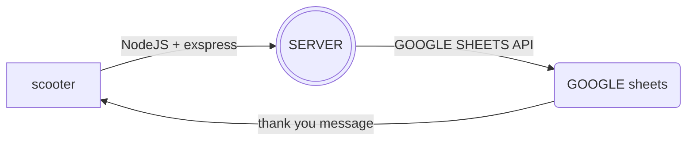

# ElectroBunny Scouting Project⚡🐰

Scouting app for FIRST Robotics Competition for ElectroBunny #1954


## Roadmap
#### 1.0.0
I guess this latest version includes everything we need about getting data from the user and uploading to the server.
In addition, it also includes CSS and design which in our opinion is good enough to give users a good enough experience and comfortable enough to scouter. The update also includes the addition of a new box responsible for selecting the robot's place at the beginning of the game, this way we can know exactly where each robot started. In addition, the absent button that allows the scouter to send the form even if the robot did not arrive and simply give us information that the robot did not arrive in the game.

#### 0.1.31
Now the form works fully and in addition it sends the files to google sheet a large part of the update is adding full integration to TBA so that every time you enter the game number and the type of robot (red 1 red 2 ect) the quota number is updated
There are still small changes to be made and more additions to be added but at the moment everything is working well and we expect to continue progressing at this pace

#### 0.0.1
Ok so it's still not a final product and you can't even start scotching yet but right now it contains a lot of very important things First we are rebuilding the entire site for full control over the site and for Albert to be happy To start everything we need a skeleton of the site which is what we are currently working on of course with the skeleton comes the code that gives all the functionality
### Progress
That's all there is for now
  - [x] a nodejs server that renders the page and keeps the scooter updated at any given time
  - [x] Data transfer between the scooter and the server
  - [x] Full connection of the server to Google services
  - [x] Basic skeleton for the scooter site
  - [x] A multipage form that includes several basic pages to simulate data transfer
  - [x] Upload data that the scooter enters into the sheet
  - [x] Full connection to the TBA (The Blue Aliience)
  - [x] Update team number according to 2 data: game number and the type of robot in the game
  - [x] Perfect CSS design for scouters
  - [x] field to select the robot's starting location
  - [x] A fully working app!!!

## Deployment

To deploy this project run

```bash
  npm install
  npm run main
```


## Environment Variables

To run this project, you will need to add the following environment variables to your credentials.json file\
You can generate all of this keys on\
Google API Console: https://console.cloud.google.com

{\
`type`\
`project_id`\
`private_key_id`\
`private_key`\
`client_email`\
`ANOTHER_API_KEY`\
`client_id`\
`auth_uri`\
`token_uri`\
`auth_provider_x509_cert_url`\
`client_x509_cert_url`\
}

In addition there is the env file which should include one environment variable
`spreadsheetId` - Represents the id of the google sheets file